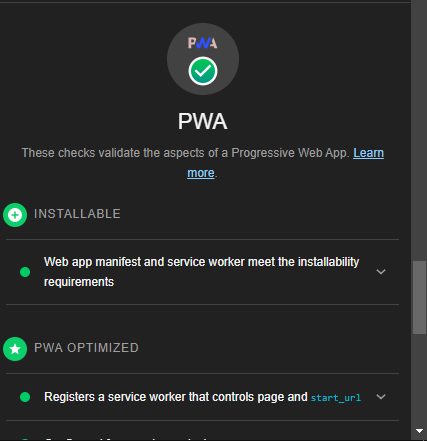

# nerdle game

## Descripton

Nerdle is the new Wordle-inspired game in town that allows you to play Wordle but with numbers and equations.

## How to Play

Guess the NERDLE in 6 tries. After each guess, the color of the tiles will change to show how close your guess was to the solution.

## Rules

Each guess is a calculation.
You can use 0 1 2 3 4 5 6 7 8 9 + - _ / or =.
It must contain one “=”.
It must only have a number to the right of the “=”, not another calculation.
Standard order of operations applies, so calculate _ and / before + and - eg. 3+2\*5=13 not 25!
If the answer we're looking for is 10+20=30, then we will accept 20+10=30 too (unless you turn off 'commutative answers' in settings).

## Features

### PWA Optimised

# For Developers

You can clone the repo on to your system then run the `npm install` command to install dependencies.

## Available Scripts

In the project directory, you can run:

### `npm start`

Runs the app in the development mode.\
Open [http://localhost:3000](http://localhost:3000) to view it in your browser.

The page will reload when you make changes.\
You may also see any lint errors in the console.
